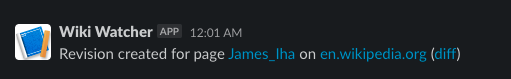

# wiki-watcher

A simple Slack bot for providing notifications of page revisions on the [Wikimedia projects](https://www.wikimedia.org/).

## Quick start

1. Create a Slack app and an Incoming Webhook in your Slack workspace as described [here](https://api.slack.com/messaging/webhooks)
1. Clone this repo and `npm install`
1. `cp config.example.json config.json`
1. In `config.json`, update `SLACK_WEBHOOK_URL` with the URL of the Webhook you created in Step 1
1. Update `WATCHED_PAGE_URLS` with the URLs of Wikimedia wiki pages you'd like to watch
1. `npm start`